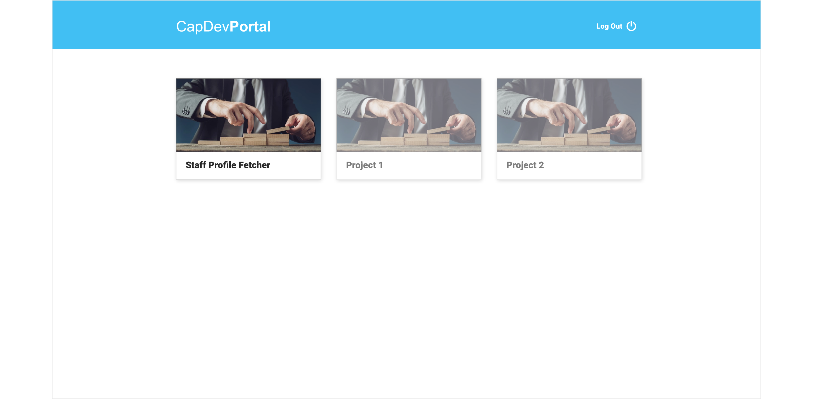
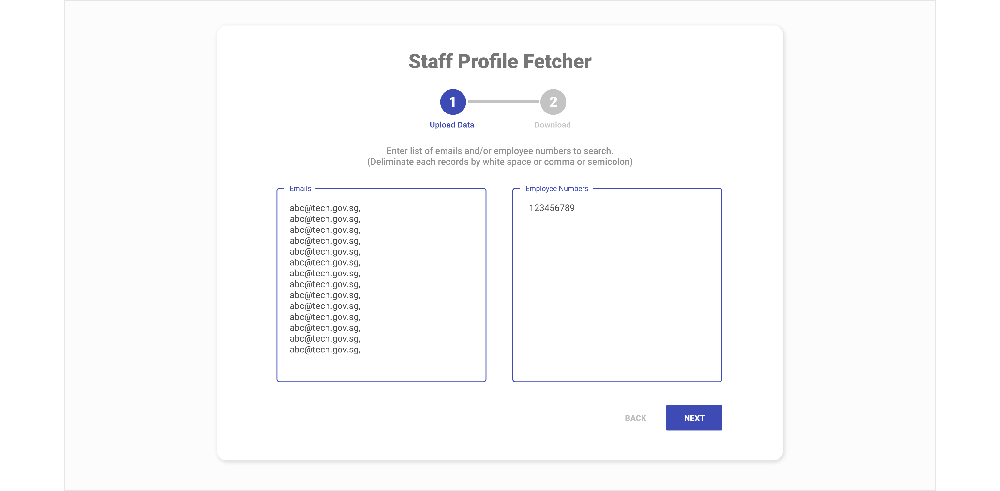
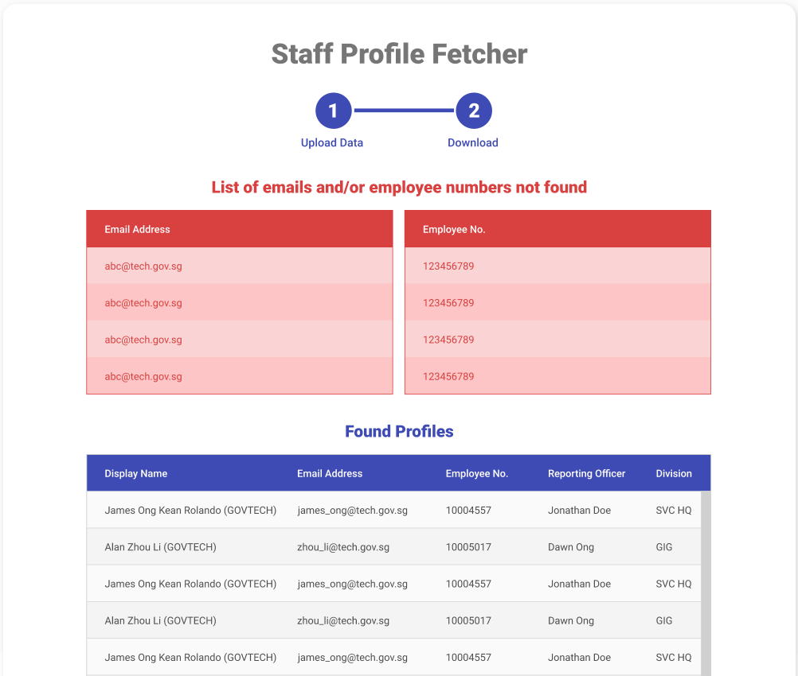
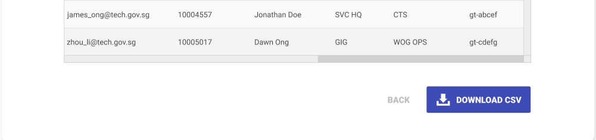
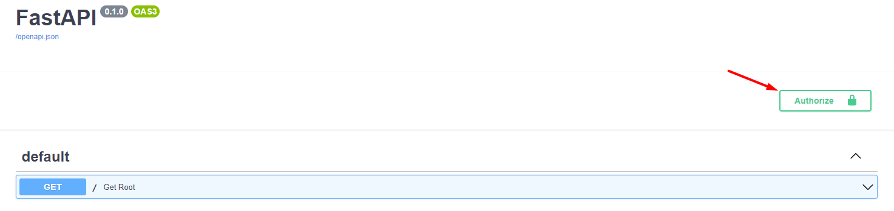
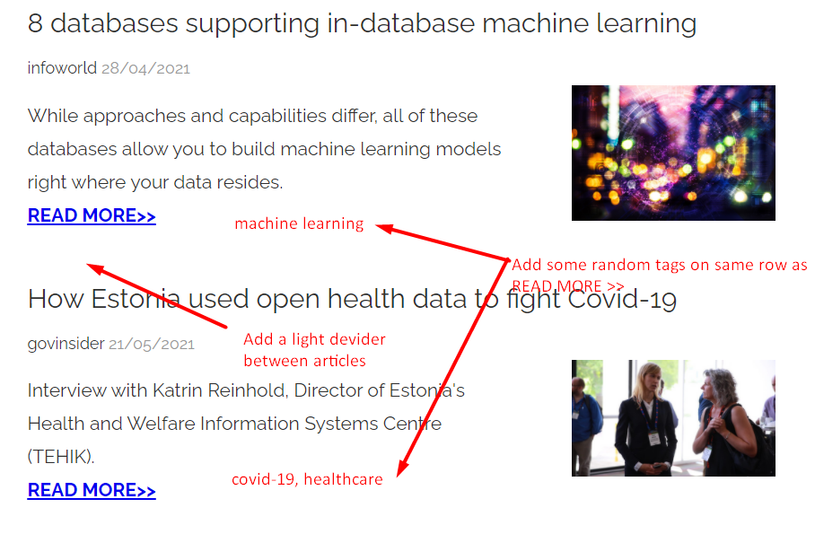

# Frontend Developer Technical Test


## Section 1: Website Development

The objective of this session is to develop a website using ReactJS with existing UI design and backend APIs. You may choose to use either TypeScript or JavaScript as programming  language. 

This website is a web portal where user can access to one or more app modules. Each app module is backed by one or more backend APIs.  You will implement the login function and one app module - Staff Profiles.


### UI Design

A few screen of UI design are provided in the folder `ui-design`. 


### Backend API - User Auth

This API is responsible for user authentication. Registered user can request for an one-time-password (OTP) to be emailed to him. With email address and OTP, he can request for a JWT token, which will be used to make requests to other backend APIs. 

Base URL: https://mxz0fg1wda.execute-api.ap-southeast-1.amazonaws.com

Docs: https://mxz0fg1wda.execute-api.ap-southeast-1.amazonaws.com/docs


### Backend API - Staff Profiles

This API is used for app module "Staff Profiles". This app module allows user to search for staff profile using email addresses and/or employee number. 

Base URL: https://u7yhkrlx15.execute-api.ap-southeast-1.amazonaws.com

Docs:  https://u7yhkrlx15.execute-api.ap-southeast-1.amazonaws.com/docs


### Screen 1 ([page1.png](./ui-design/page1.png))

- An registered user enter his email address to request for an OTP. The OTP will be emailed to him through his registered email.
- Related API:  [/v1/auth/get_otp_email](https://mxz0fg1wda.execute-api.ap-southeast-1.amazonaws.com/docs#/Auth/get_otp_email_v1_auth_get_otp_email_post)


### Screen 2 ([page2.png](./ui-design/page2.png))

* User retrieve OTP from his email and use it to login. Backend API will return a JWT token.

* Each OTP is a 6-digit number. 

* Related API:  [/v1/auth/get_jwt_token](https://mxz0fg1wda.execute-api.ap-southeast-1.amazonaws.com/docs#/Auth/get_jwt_token_v1_auth_get_jwt_token_post)

* In the payload of a JWT token, apart from user name and email, it also contains the list of app modules which user is authorized to access. For example, following user `Mark GMAIL` can access to app `Staff Profile` and `News EDM`. 

  ```json
  {
    "email": "mark.qj@gmail.com",
    "name": "Mark GMAIL",
    "permissions": [
      "staff_profiles",
      "news_edm"
    ]
  }
  ```

* The [/v1/auth/get_apps](https://mxz0fg1wda.execute-api.ap-southeast-1.amazonaws.com/docs#/Auth/get_apps_v1_auth_get_apps_get) API provides list of available apps and their description.


### Screen 3 ([page3.png](./ui-design/page3.png))

* It displays list of app modules. (You may use any picture for app badges.)
* For app modules which user does not have permissions, the app badges will be disabled (in grey).  
* Related API:  [/v1/auth/get_apps](https://mxz0fg1wda.execute-api.ap-southeast-1.amazonaws.com/docs#/Auth/get_apps_v1_auth_get_apps_get)



### Screen 4 ([page4.png](./ui-design/page4.png))

* User can input a list of email address and/or employee numbers to look up for profiles. 
* Refer to the API docs for list of sample valid/invalid email addresses and employee numbers. 
* Related API: [/v1/profiles/fetch_by_json](https://u7yhkrlx15.execute-api.ap-southeast-1.amazonaws.com/docs#/Profiles/fetch_by_json_v1_profiles_fetch_by_json_post)




### Screen 5 ([page5-1.png](./ui-design/page5-1.png), [page5-2.png](./ui-design/page5-2.png))

* API returns list of profiles, as well as list of email address and employee numbers which are not found in database.
* User can download the profiles as a CSV file. 
* Related API: [/v1/profiles/fetch_by_csv](https://u7yhkrlx15.execute-api.ap-southeast-1.amazonaws.com/docs#/Profiles/fetch_by_csv_v1_profiles_fetch_by_csv_post)





#### Note:

For [Staff Profiles API](https://u7yhkrlx15.execute-api.ap-southeast-1.amazonaws.com/docs), you can set the JWT token in Authorization header as show  in following printscreen.




## Section 2:  CSS Modification

The objective of this session is to test your skills in CSS and HTML. 

The `html_css` folder contains a HTML file `message.html`. Make following 2 changes to the file.

- Add a light divider between 2 articles so that they are more visually separated.
- It is common to add tags to articles. For first article, add some random tags to the article, e.g. `covid-19, govtech`. 





## Submission Guidelines

For section 1, deploy your website somewhere and email us the link. 

Please create a GitHub repository containing your submission for both section 1 and section 2. You will walk through both section 1 and section 2 in GitHub if you are selected for 2nd interview. 


Dos:

- Frequent commits
- Descriptive commit messages
- Clear Documentation
- Comments in your code

Don'ts:

* Only one commit for all your files
* Submit a zip file
* Sparse or absent documentation

